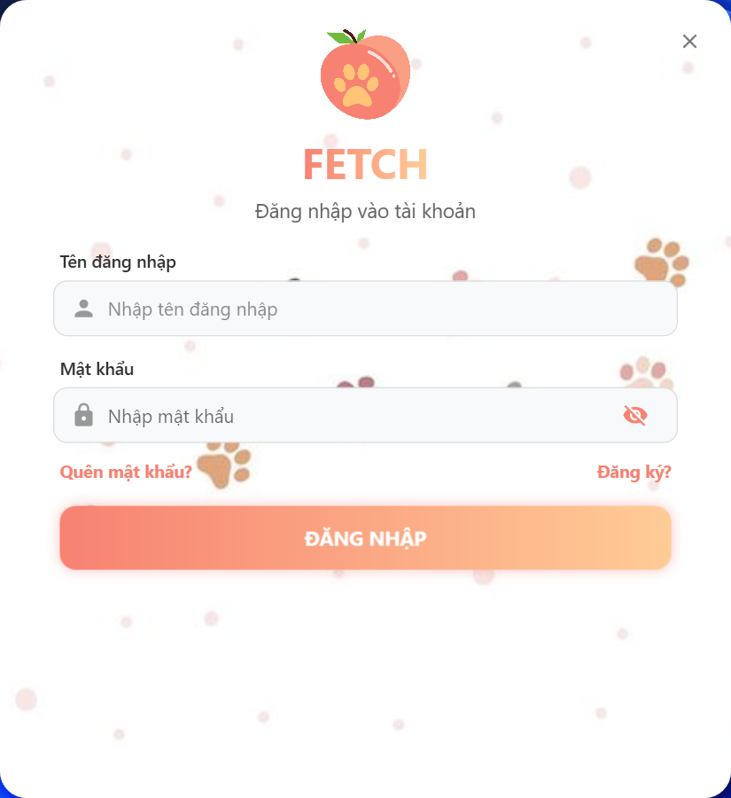
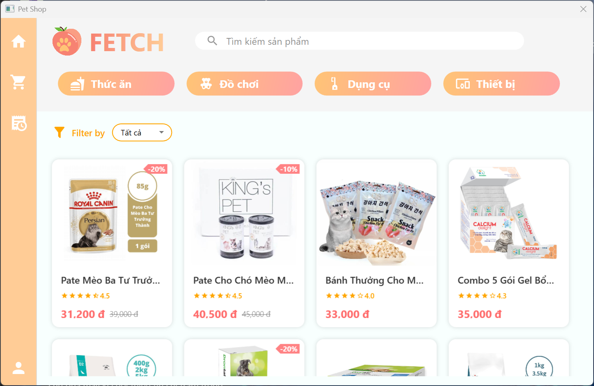
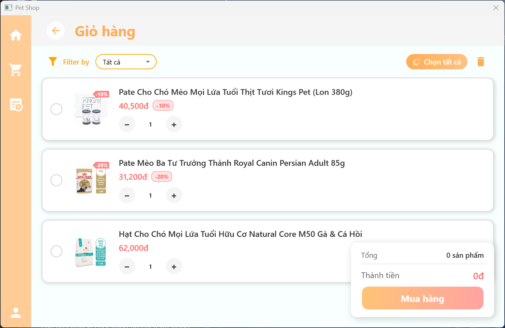
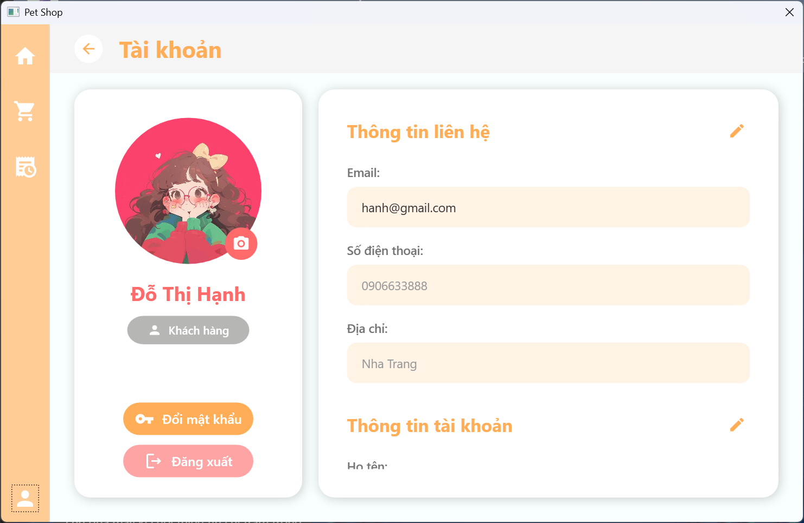
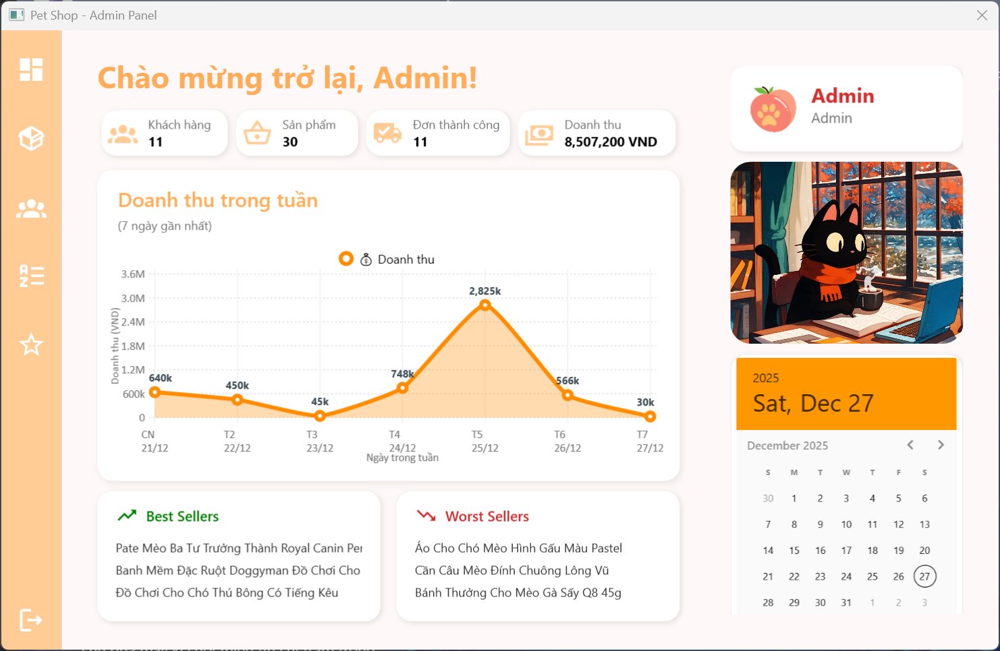
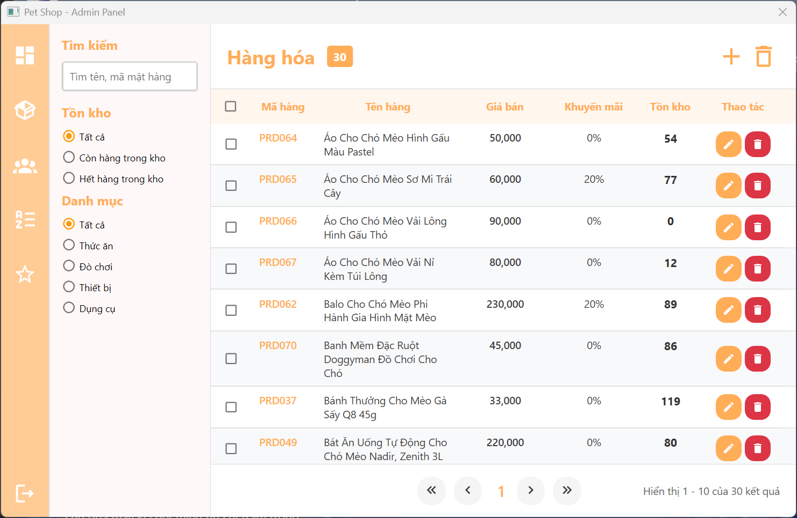
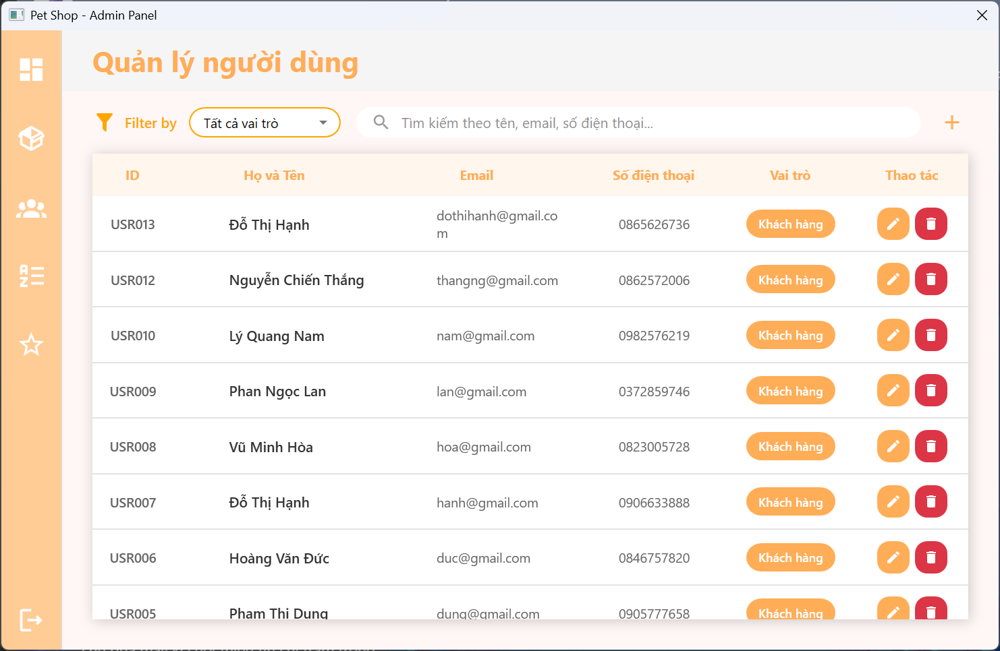
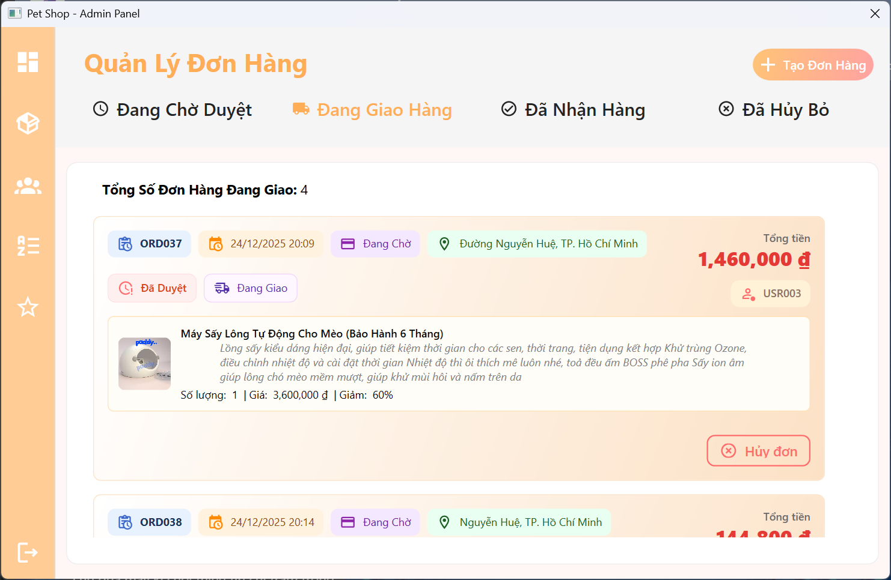
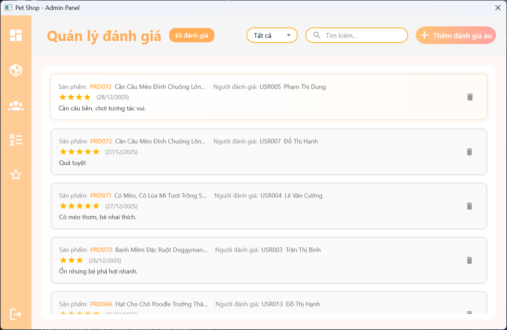

# FETCH – HỆ THỐNG QUẢN LÝ VÀ BÁN HÀNG TIỆN ÍCH CHO THÚ CƯNG

## 1. Giới thiệu

**Fetch** là ứng dụng được phát triển trong khuôn khổ đồ án môn học **Lập trình trực quan (IT008.Q12)** của nhóm 9.
Dự án mô phỏng một hệ thống quản lý và bán các sản phẩm dành cho thú cưng, hướng tới việc hỗ trợ người dùng mua sắm và quản trị viên quản lý hệ thống một cách hiệu quả.

Hệ thống bao gồm hai nhóm người dùng chính:

* **Khách hàng:** có thể đăng ký, đăng nhập, xem và mua sản phẩm, theo dõi đơn hàng.
* **Quản trị viên:** có thể quản lý sản phẩm, đơn hàng, người dùng và thống kê doanh thu.

---

## 2. Chức năng chính

### 2.1. Dành cho người dùng (Khách hàng)

* Đăng ký và đăng nhập tài khoản
* Xem danh sách và chi tiết sản phẩm
* Tìm kiếm và lọc sản phẩm theo loại, giá
* Thêm sản phẩm vào giỏ hàng
* Đặt hàng và thanh toán (mô phỏng)
* Xem lịch sử đơn hàng
* Cập nhật thông tin tài khoản

### 2.2. Dành cho quản trị viên (Admin)

* Đăng nhập vào hệ thống quản lý
* Quản lý danh mục và kho sản phẩm
* Quản lý đơn hàng
* Quản lý thông tin người dùng
* Quản lý đánh giá sản phẩm
* Thống kê doanh thu và tình hình kinh doanh

---

## 3. Công nghệ sử dụng

| Thành phần            | Mô tả                                        |
| --------------------- | -------------------------------------------- |
| Ngôn ngữ và nền tảng  | WPF (.NET Framework)                         |
| Cơ sở dữ liệu         | SQL Server                                   |
| Môi trường phát triển | Windows                                      |
| Công cụ hỗ trợ        | Visual Studio, Git & GitHub, ChatGPT, Claude |

---

## 4. Hướng dẫn cài đặt và chạy dự án
[▶️ XEM VIDEO HƯỚNG DẪN](https://drive.google.com/file/d/10iBpNYwbJyoonjimntKvpF_2Q4NpPH6T/view?usp=sharing)

* B1: Lấy dự án về máy: git clone https://github.com/hcyk268/PetShop.git
* B2: Mở thư mục PetShop sau khi kéo về. Trong thư mục Data có file database PETSHOP.bak
* B3: Sử dụng SQL Sever Express vào SSMS thực hiện restore database với file PETSHOP.bak
* B4: Mở dự án bằng Visual Studio
* B5 (Nếu chưa chạy được liền): Chuột phải vào Solution 'Pet-Shop-Project' ở Solution Explorer, chọn Restore Nuget Packages
* B6: Chạy dự án

---

## 5. Tài khoản mẫu

| Vai trò       | Tên đăng nhập  | Mật khẩu    |
| ------------- | -------------- | ----------- |
| Quản trị viên | `adminpetshop` | `admin123`  |
| Người dùng    | `usertest`     | `user12345` |

---

## 6. Thành viên thực hiện

| MSSV     | Họ và tên          | Vai trò                            |
| -------- | ------------------ | ---------------------------------- |
| 24520443 | Võ Văn Hải         | Trưởng nhóm, Lập trình viên        |
| 24520065 | Nguyễn Quốc An     | Lập trình viên, Thiết kế giao diện |
| 24520474 | Ngô Phương Hiền    | Lập trình viên, Quản lý dữ liệu    |
| 24520063 | Nguyễn Ngọc Thu An | Lập trình viên                     |

---

## 7. Giảng viên hướng dẫn

* Ths. **Võ Tuấn Kiệt**

## 8. Giao diện ứng dụng

### 8.1. Giao diện người dùng

  
   
  <i>Màn hình đăng nhập</i>

  
   
  <i>Trang chủ - Danh sách sản phẩm</i>

  
   
  <i>Giỏ hàng</i>

  
   
  <i>Quản lý đơn hàng</i>

  
   
  <i>Thông tin tài khoản</i>

### 8.2. Giao diện quản trị viên

  
   
  <i>Dashboard - Thống kê tổng quan</i>

  
   
  <i>Quản lý sản phẩm</i>

  
   
  <i>Quản lý người dùng</i>

  
   
  <i>Quản lý đơn hàng</i>

  
   
  <i>Quản lý đánh giá</i>

